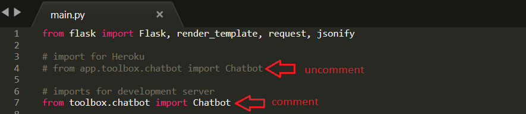

# Projet-7-GrandPy

This project is a web application,

A simple chatbot that give you address, map and short story about a place you are looking for ! ;)

## Installation

The following steps are for windows:

**Clone this repository with:**
```sh
$git clone https://github.com/MassDo/Projet-7-GrandPy.git
```
**Install a virtual environment with venv like this:**
```sh
python -m venv venv
```
**Activate the virtual environment**
```sh
venv\scripts\activate
```
**Install dependencies with pip :**
```sh
pip install -r requirements.txt
```

## Run the app

```sh
python app\main.py
```
The application is running on local http://127.0.0.1:5000/

## Deploying on heroku

Install heroku with this link:

https://devcenter.heroku.com/articles/heroku-cli#download-and-install

Deploy the app with this tutorial:

https://devcenter.heroku.com/articles/git

Wait you have one Last thing to do ! You need to go to the main.py module and do this changes:



